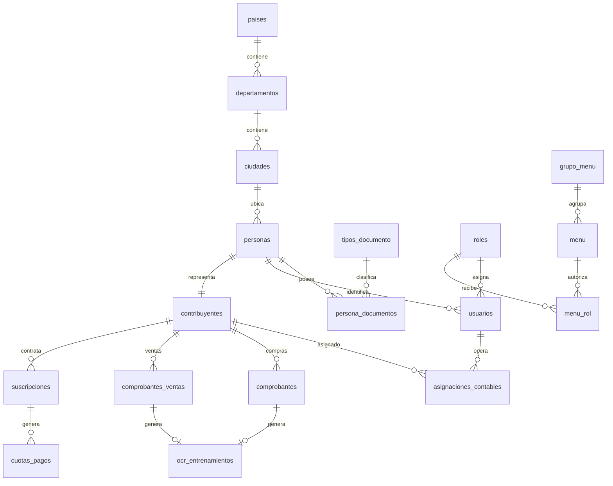

# Base de Datos - Sistema de Lectura y Registro de Comprobantes IVA

## 1. Objetivo del documento

Este documento explica la estructura de la base de datos del sistema de lectura de facturas y comprobantes tributarios. La base está preparada para trabajar con contribuyentes, usuarios, roles, menú, permisos de acciones, comprobantes de compras, comprobantes de ventas, validaciones orientadas a SET/Marangatu, trazabilidad OCR y control de acceso por contribuyente.

La explicación está pensada para que cualquier desarrollador pueda entender la base antes de tocar la API, el frontend o las validaciones fiscales. No se listan datos semilla, usuarios de prueba, contraseñas, hashes ni datos personales cargados, porque este documento se enfoca en la arquitectura y no en la información existente dentro de la base.

## 2. Alcance funcional de la base

La base cubre estos bloques principales:

| Módulo | Tablas | Responsabilidad |
|---|---|---|
| Geografía | `paises`, `departamentos`, `ciudades` | Normalizar ubicación de personas y contribuyentes. |
| Personas | `personas`, `tipos_documento`, `persona_documentos` | Registrar sujetos físicos o jurídicos asociados al sistema. |
| Seguridad e IAM | `roles`, `usuarios`, `grupo_menu`, `menu`, `menu_rol`, `refresh_tokens`, `password_reset_tokens` | Manejar login, rol, menú visible, permisos de acción, refresh token (30d) y recuperación de contraseña. |
| Negocio tributario | `contribuyentes`, `asignaciones_contables` | Registrar contribuyentes y asignar qué usuarios pueden operar sobre ellos. |
| Operación SET/OCR | `comprobantes`, `comprobantes_ventas`, `set_rucs`, `ocr_entrenamientos` | Guardar comprobantes leídos, datos extraídos, validaciones y trazabilidad del OCR. |
| Cobranzas SaaS | `suscripciones`, `cuotas_pagos` | Administrar estado comercial del contribuyente dentro del servicio. |

**Estado actual del schema:** 22 tablas. Verificado y aplicado 2026-06-05. Script idempotente: `schema_bd_sis_iva.sql`.

## 3. Base normativa considerada para SET/Marangatu

La estructura de comprobantes fue pensada tomando como referencia el registro de comprobantes de ventas, compras, ingresos y egresos usado por Marangatu. El objetivo fiscal del sistema es conservar información suficiente para poder registrar o preparar datos de comprobantes con incidencia tributaria.

### 3.1 Tipos de registros SET

| Código | Registro |
|---:|---|
| `1` | Ventas |
| `2` | Compras |
| `3` | Ingresos |
| `4` | Egresos |

En la base actual, los casos modelados físicamente son principalmente:

| Registro SET | Tabla actual | Estado actual |
|---|---|---|
| Compras | `comprobantes` | Implementado como comprobantes recibidos/proveedores/emisores. |
| Ventas | `comprobantes_ventas` | Implementado como comprobantes emitidos por el contribuyente hacia clientes. |
| Ingresos | No tiene tabla física separada actualmente | Puede incorporarse siguiendo el patrón de `comprobantes_ventas` si el alcance crece. |
| Egresos | No tiene tabla física separada actualmente | Puede incorporarse siguiendo el patrón de `comprobantes` si el alcance crece. |

### 3.2 Condición de operación

| Código | Condición |
|---:|---|
| `1` | Contado |
| `2` | Crédito |

En las tablas se maneja con el campo `condicion_operacion`. El valor por defecto usado es `1`, equivalente a contado. Para facturas SET tipo `109`, la condición de operación debe ser considerada obligatoria a nivel de validación de API.

### 3.3 Tipos de identificación

| Código | Identificación |
|---:|---|
| `11` | RUC |
| `12` | Cédula de Identidad |
| `13` | Pasaporte |
| `14` | Cédula Extranjero |
| `15` | Sin Nombre |
| `16` | Diplomático |
| `17` | Identificación Tributaria |

La base actual no tiene una tabla referencial `set_tipos_identificacion`; estos códigos se manejan como regla de negocio en la API o en catálogos internos futuros. Para compras y ventas, el sistema guarda directamente `ruc_emisor`, `ruc_cliente` o identificaciones equivalentes según corresponda.

### 3.4 Tipos de comprobantes SET relevantes

| Código | Comprobante | Tipo de registro |
|---:|---|---|
| `101` | Autofactura | Compras |
| `102` | Boleta de transporte público de pasajeros | Ventas, Compras |
| `103` | Boleta de venta | Ventas, Compras |
| `104` | Boleta Resimple | Compras |
| `105` | Boletos de loterías, juegos de azar | Ventas, Compras |
| `106` | Boleto o ticket de transporte aéreo | Ventas, Compras |
| `107` | Despacho de importación | Compras |
| `108` | Entrada a espectáculos públicos | Ventas, Compras |
| `109` | Factura | Ventas, Compras |
| `110` | Nota de crédito | Ventas, Compras |
| `111` | Nota de débito | Ventas, Compras |
| `112` | Ticket máquina registradora | Ventas, Compras |
| `201` | Comprobante de egresos por compras a crédito | Egresos |
| `202` | Comprobante del exterior legalizado | Egresos |
| `203` | Comprobante de ingreso por ventas a crédito | Ingresos |
| `204` | Comprobante de ingresos entidades públicas, religiosas o de beneficio público | Egresos |
| `205` | Extracto de cuenta - billetaje electrónico | Egresos |
| `206` | Extracto de cuenta de IPS | Egresos |
| `207` | Extracto de cuenta TC/TD | Egresos |
| `208` | Liquidación de salario | Ingresos, Egresos |
| `209` | Otros comprobantes de egresos | Egresos |
| `210` | Otros comprobantes de ingresos | Ingresos |
| `211` | Transferencias o giros bancarios / boleta de depósito | Egresos |

En las tablas actuales, el campo que concentra este dato es `tipo_comprobante_set`.

### 3.5 Valores booleanos SET

| Código | Valor |
|---|---|
| `S` | Sí |
| `N` | No |

Se utiliza para campos como `moneda_extranjera`, `imputa_iva`, `imputa_ire`, `imputa_irp` y `no_imputa`.

### 3.6 Reglas técnicas de importación que impactan a la base y API

Aunque la base no genera necesariamente el archivo final de importación, debe conservar datos compatibles con las reglas técnicas:

- Los archivos de importación se preparan en formato `.CSV` o `.TXT` con codificación `UTF-8`.
- Para envío a Marangatu, el archivo debe comprimirse en `.ZIP` con el mismo nombre del archivo contenido.
- El nombre del archivo usa el RUC del contribuyente sin dígito verificador.
- Los valores de RUC dentro del archivo también se cargan sin dígito verificador.
- Cada archivo puede contener hasta 5.000 filas de datos.
- Los montos deben ser enteros positivos, sin decimales. El separador de miles permitido es el punto.
- Un comprobante debe imputar al menos a una obligación tributaria vigente: IVA, IRE o IRP-RSP. Si `no_imputa = 'S'`, igual debe existir una parte imputada a alguna obligación.
- Los campos deben respetar el orden exigido por cada tipo de registro: ventas, compras, ingresos o egresos.

## 4. Diagrama general de relaciones



## 5. Explicación tabla por tabla

---

## 5.1 Tabla `paises`

### Propósito

Tabla base del módulo geográfico. Sirve para registrar países y permitir que departamentos y ciudades estén normalizados. Aunque el sistema arranque con Paraguay, la tabla permite crecer a otros países sin cambiar la estructura de personas o contribuyentes.

### Campos

| Campo | Tipo | Obligatorio | Descripción |
|---|---:|---:|---|
| `id` | `INT UNSIGNED AUTO_INCREMENT` | Sí | Identificador único del país. |
| `nombre` | `VARCHAR(100)` | Sí | Nombre del país. |

### Claves y relaciones

| Elemento | Detalle |
|---|---|
| PK | `id` |
| Referenciada por | `departamentos.pais_id` |

### Reglas funcionales

- No debe borrarse un país si tiene departamentos asociados.
- En producción conviene evitar duplicados por nombre mediante un índice único lógico o validación de API.

---

## 5.2 Tabla `departamentos`

### Propósito

Registra departamentos o divisiones administrativas dentro de un país. En Paraguay permite registrar Central, Asunción, Alto Paraná, etc.

### Campos

| Campo | Tipo | Obligatorio | Descripción |
|---|---:|---:|---|
| `id` | `INT UNSIGNED AUTO_INCREMENT` | Sí | Identificador único del departamento. |
| `nombre` | `VARCHAR(100)` | Sí | Nombre del departamento. |
| `pais_id` | `INT UNSIGNED` | Sí | País al que pertenece. |

### Claves, índices y relaciones

| Elemento | Detalle |
|---|---|
| PK | `id` |
| FK | `pais_id` -> `paises.id` |
| Índice | `fk_departamentos_paises_idx` sobre `pais_id` |
| `ON DELETE` | `RESTRICT` |
| `ON UPDATE` | `CASCADE` |

### Reglas funcionales

- Un departamento siempre pertenece a un país.
- No se permite eliminar un país si existen departamentos asociados.
- La actualización del `id` de país se propaga por `ON UPDATE CASCADE`, aunque en la práctica no se recomienda modificar claves primarias.

---

## 5.3 Tabla `ciudades`

### Propósito

Registra ciudades relacionadas a departamentos. Es utilizada por `personas` para normalizar ubicación.

### Campos

| Campo | Tipo | Obligatorio | Descripción |
|---|---:|---:|---|
| `id` | `INT UNSIGNED AUTO_INCREMENT` | Sí | Identificador único de la ciudad. |
| `nombre` | `VARCHAR(100)` | Sí | Nombre de la ciudad. |
| `departamento_id` | `INT UNSIGNED` | Sí | Departamento al que pertenece. |

### Claves, índices y relaciones

| Elemento | Detalle |
|---|---|
| PK | `id` |
| FK | `departamento_id` -> `departamentos.id` |
| Índice | `fk_ciudades_departamentos_idx` sobre `departamento_id` |
| `ON DELETE` | `RESTRICT` |
| `ON UPDATE` | `CASCADE` |

### Reglas funcionales

- Una ciudad siempre pertenece a un departamento.
- No se puede eliminar un departamento con ciudades asociadas.
- Permite que las personas mantengan una ubicación consistente sin repetir texto libre.

---

## 5.4 Tabla `personas`

### Propósito

Tabla central de sujetos. Representa a una persona física o jurídica base para usuarios y contribuyentes. La idea es no repetir datos personales dentro de `usuarios` o `contribuyentes`.

### Campos

| Campo | Tipo | Obligatorio | Descripción |
|---|---:|---:|---|
| `id` | `INT UNSIGNED AUTO_INCREMENT` | Sí | Identificador único de la persona. |
| `nombre` | `VARCHAR(100)` | Sí | Nombre o primer componente del nombre. |
| `apellido` | `VARCHAR(100)` | Sí | Apellido o segundo componente identificatorio. |
| `telefono` | `VARCHAR(20)` | No | Teléfono de contacto. |
| `direccion` | `VARCHAR(255)` | No | Dirección declarada. |
| `ciudad_id` | `INT UNSIGNED` | No | Ciudad relacionada. |

> ⚠️ **`email_contacto` NO existe** en la entidad TypeORM actual ni en el schema SQL. El email de acceso al sistema vive en `usuarios.email`. Si se necesita email de contacto independiente del login, debe agregarse como mejora futura (ALTER TABLE + actualizar entidad).

### Claves, índices y relaciones

| Elemento | Detalle |
|---|---|
| PK | `id` |
| FK | `ciudad_id` -> `ciudades.id` |
| Índice | `fk_personas_ciudades_idx` sobre `ciudad_id` |
| `ON DELETE` | `SET NULL` |
| `ON UPDATE` | `CASCADE` |
| Referenciada por | `usuarios.persona_id`, `contribuyentes.persona_id`, `persona_documentos.persona_id` |

### Reglas funcionales

- Si se elimina una ciudad, la persona no se elimina; solamente se deja `ciudad_id` en `NULL`.
- Una persona puede tener varios documentos mediante `persona_documentos`.
- Una persona puede convertirse en usuario del sistema mediante `usuarios`.
- Una persona puede representar un contribuyente mediante `contribuyentes`.

---

## 5.5 Tabla `tipos_documento`

### Propósito

Catálogo interno para definir tipos de documentos usados por personas. Por ejemplo: cédula, RUC u otros documentos.

### Campos

| Campo | Tipo | Obligatorio | Descripción |
|---|---:|---:|---|
| `id` | `INT UNSIGNED AUTO_INCREMENT` | Sí | Identificador único del tipo de documento. |
| `nombre` | `VARCHAR(100)` | Sí | Nombre descriptivo del documento. Debe ser único. |
| `codigo` | `VARCHAR(10)` | Sí | Código corto del documento. Debe ser único. |

### Claves y restricciones

| Elemento | Detalle |
|---|---|
| PK | `id` |
| Unique | `nombre` |
| Unique | `codigo` |
| Referenciada por | `persona_documentos.tipo_documento_id` |

### Reglas funcionales

- Evita inconsistencias como registrar `CI`, `Cedula`, `Cédula` de diferentes formas.
- Para integración SET, este catálogo puede convivir con los códigos oficiales de identificación `11`, `12`, `13`, etc. Si se desea mayor precisión fiscal, puede agregarse un campo futuro `codigo_set`.

---

## 5.6 Tabla `persona_documentos`

### Propósito

Relaciona personas con sus documentos. Permite que una persona tenga diferentes identificaciones sin duplicar datos en la tabla `personas`.

### Campos

| Campo | Tipo | Obligatorio | Descripción |
|---|---:|---:|---|
| `id` | `INT UNSIGNED AUTO_INCREMENT` | Sí | Identificador único del documento registrado. |
| `persona_id` | `INT UNSIGNED` | Sí | Persona propietaria del documento. |
| `tipo_documento_id` | `INT UNSIGNED` | Sí | Tipo de documento. |
| `numero` | `VARCHAR(50)` | Sí | Número del documento. |

### Claves, índices y relaciones

| Elemento | Detalle |
|---|---|
| PK | `id` |
| FK | `persona_id` -> `personas.id` |
| FK | `tipo_documento_id` -> `tipos_documento.id` |
| Unique | `idx_persona_tipo_unico` sobre `persona_id`, `tipo_documento_id` |
| `ON DELETE persona` | `CASCADE` |
| `ON DELETE tipo_documento` | `RESTRICT` |
| `ON UPDATE` | `CASCADE` |

### Reglas funcionales

- La restricción `idx_persona_tipo_unico` evita que una misma persona tenga duplicado el mismo tipo de documento.
- Si se elimina una persona, se eliminan sus documentos relacionados.
- No se puede eliminar un tipo de documento si ya fue usado por alguna persona.

---

## 5.7 Tabla `roles`

### Propósito

Define perfiles de acceso del sistema. Un rol representa un conjunto de permisos sobre menús y acciones. Ejemplos conceptuales: Administrador, Contador, Supervisor, Operador.

### Campos

| Campo | Tipo | Obligatorio | Descripción |
|---|---:|---:|---|
| `id` | `INT UNSIGNED AUTO_INCREMENT` | Sí | Identificador único del rol. |
| `nombre` | `VARCHAR(50)` | Sí | Nombre único del rol. |
| `descripcion` | `TEXT` | No | Descripción funcional del rol. |

### Claves y relaciones

| Elemento | Detalle |
|---|---|
| PK | `id` |
| Unique | `nombre` |
| Referenciada por | `usuarios.rol_id`, `menu_rol.rol_id` |

### Reglas funcionales

- El rol no da permisos por sí solo si no tiene registros en `menu_rol`.
- El rol del usuario sirve para construir el menú visible y las acciones disponibles.
- Para producción, todo permiso sensible debe validarse también en API, no solamente ocultarse en frontend.

---

## 5.8 Tabla `usuarios`

### Propósito

Registra las cuentas que pueden ingresar al sistema. Cada usuario se vincula a una persona y a un rol.

### Campos

| Campo | Tipo | Obligatorio | Descripción |
|---|---:|---:|---|
| `id` | `INT UNSIGNED AUTO_INCREMENT` | Sí | Identificador único del usuario. |
| `email` | `VARCHAR(255)` | Sí | Email de login. Debe ser único. |
| `password` | `VARCHAR(255)` | Sí | Contraseña cifrada/hash. Nunca debe guardarse en texto plano. |
| `persona_id` | `INT UNSIGNED` | Sí | Persona asociada al usuario. |
| `rol_id` | `INT UNSIGNED` | Sí | Rol principal del usuario. |
| `activo` | `BOOLEAN` | Sí | Indica si el usuario puede operar. Valor por defecto: `TRUE`. |
| `es_temporal` | `BOOLEAN` | Sí | Indica si la cuenta es temporal. Valor por defecto: `FALSE`. |
| `created_at` | `TIMESTAMP` | No | Fecha de creación. Valor por defecto: fecha/hora actual. |

### Claves y relaciones

| Elemento | Detalle |
|---|---|
| PK | `id` |
| Unique | `email` |
| FK | `persona_id` -> `personas.id` |
| FK | `rol_id` -> `roles.id` |
| Referenciada por | `asignaciones_contables.usuario_id` |

### Reglas funcionales

- Un usuario inactivo no debe poder autenticarse ni ejecutar acciones de negocio.
- La API debe usar `rol_id` para resolver permisos de menú y acciones.
- La API debe usar `asignaciones_contables` para validar qué contribuyentes puede operar el usuario.
- La columna `password` debe almacenar únicamente hash seguro.
- `email_contacto` de `personas` y `email` de `usuarios` tienen propósitos diferentes: uno es contacto, el otro es credencial de acceso.

---

## 5.9 Tabla `grupo_menu`

### Propósito

Agrupa opciones del menú del sistema. Permite ordenar y separar funcionalidades en bloques como Seguridad, Comprobantes, Contribuyentes, Reportes, Administración, etc.

### Campos

| Campo | Tipo | Obligatorio | Descripción |
|---|---:|---:|---|
| `id` | `INT UNSIGNED AUTO_INCREMENT` | Sí | Identificador único del grupo. |
| `nombre` | `VARCHAR(100)` | Sí | Nombre único del grupo de menú. |

### Claves y relaciones

| Elemento | Detalle |
|---|---|
| PK | `id` |
| Unique | `nombre` |
| Referenciada por | `menu.grupo_menu_id` |

### Reglas funcionales

- Un grupo de menú ordena visualmente el sistema.
- No define permisos directamente; los permisos reales están en `menu_rol`.
- Permite mantener una navegación escalable conforme crecen los módulos.

---

## 5.10 Tabla `menu`

### Propósito

Define cada opción navegable del sistema. Una opción de menú representa una pantalla, ruta o módulo funcional.

### Campos

| Campo | Tipo | Obligatorio | Descripción |
|---|---:|---:|---|
| `id` | `INT UNSIGNED AUTO_INCREMENT` | Sí | Identificador único del menú. |
| `nombre` | `VARCHAR(100)` | Sí | Nombre visible o descriptivo de la opción. |
| `grupo_menu_id` | `INT UNSIGNED` | Sí | Grupo al que pertenece. |
| `url` | `VARCHAR(255)` | Sí | Ruta del frontend o identificador de navegación. |

### Claves y relaciones

| Elemento | Detalle |
|---|---|
| PK | `id` |
| FK | `grupo_menu_id` -> `grupo_menu.id` |
| Referenciada por | `menu_rol.menu_id` |

### Reglas funcionales

- Una ruta puede existir en frontend, pero solo debe mostrarse si el rol tiene permiso en `menu_rol`.
- El campo `url` sirve para vincular la opción con la ruta del frontend.
- Para producción conviene validar unicidad de `url`, evitando dos menús distintos apuntando a la misma pantalla sin intención.

---

## 5.11 Tabla `menu_rol`

### Propósito

Es la tabla central del sistema de permisos. Relaciona un menú con un rol y define qué acciones puede ejecutar ese rol dentro de ese menú.

Esta tabla permite manejar seguridad de forma granular:

- qué menú puede ver el rol;
- si puede listar registros;
- si puede guardar nuevos registros;
- si puede editar registros existentes;
- si puede eliminar registros.

### Campos

| Campo | Tipo | Obligatorio | Descripción |
|---|---:|---:|---|
| `id` | `INT UNSIGNED AUTO_INCREMENT` | Sí | Identificador único del permiso. |
| `menu_id` | `INT UNSIGNED` | Sí | Menú sobre el cual aplica el permiso. |
| `rol_id` | `INT UNSIGNED` | Sí | Rol al que se otorga o restringe el permiso. |
| `permitir_listar` | `BOOLEAN` | No | Permite ver/listar la pantalla o registros del menú. Valor por defecto: `0`. |
| `permitir_guardar` | `BOOLEAN` | No | Permite crear nuevos registros. Valor por defecto: `0`. |
| `permitir_editar` | `BOOLEAN` | No | Permite modificar registros existentes. Valor por defecto: `0`. |
| `permitir_eliminar` | `BOOLEAN` | No | Permite eliminar registros. Valor por defecto: `0`. |

### Claves y relaciones

| Elemento | Detalle |
|---|---|
| PK | `id` |
| FK | `menu_id` -> `menu.id` |
| FK | `rol_id` -> `roles.id` |

### Reglas funcionales

- Si `permitir_listar = 0`, el menú no debería mostrarse y la API no debería permitir consultar la información de esa pantalla.
- Si `permitir_guardar = 0`, el botón de creación debe ocultarse y la API debe rechazar la operación de creación.
- Si `permitir_editar = 0`, el botón o acción de edición debe ocultarse y la API debe rechazar operaciones `PUT`/`PATCH`.
- Si `permitir_eliminar = 0`, el botón de eliminación debe ocultarse y la API debe rechazar operaciones `DELETE`.
- La seguridad no debe depender únicamente del frontend. El frontend mejora la experiencia ocultando opciones, pero la API debe validar siempre.
- Para producción se recomienda agregar una restricción única sobre `menu_id` + `rol_id`, para evitar permisos duplicados para el mismo menú y rol.

### Flujo recomendado de uso

1. El usuario inicia sesión.
2. La API identifica `usuarios.rol_id`.
3. La API consulta `menu_rol` unido con `menu` y `grupo_menu`.
4. El frontend recibe solo los menús permitidos o recibe permisos por menú.
5. El frontend muestra botones según `permitir_guardar`, `permitir_editar` y `permitir_eliminar`.
6. La API vuelve a validar el mismo permiso antes de ejecutar cada operación.

---

## 5.12 Tabla `contribuyentes`

### Propósito

Representa a los contribuyentes administrados por el sistema. Es la entidad tributaria principal sobre la cual se registran compras, ventas, suscripciones y asignaciones de usuarios.

### Campos

| Campo | Tipo | Obligatorio | Descripción |
|---|---:|---:|---|
| `id` | `INT UNSIGNED AUTO_INCREMENT` | Sí | Identificador único del contribuyente. |
| `persona_id` | `INT UNSIGNED` | Sí | Persona asociada. Es único. |
| `ruc` | `VARCHAR(20)` | Sí | RUC sin o con formato interno según carga del sistema. Para exportación SET debe usarse sin DV. |
| `dv` | `INT` | Sí | Dígito verificador del RUC. |
| `razon_social` | `VARCHAR(255)` | Sí | Razón social del contribuyente. |
| `tipo_impuesto` | `ENUM('IVA_GENERAL','IRP_RSP','IRE_RESIMPLE')` | Sí | Tipo de impuesto o régimen principal asociado. |
| `deleted_at` | `TIMESTAMP NULL` | No | Soft delete. `NULL` = activo. Cuando se elimina vía API, se setea a la fecha actual. Los `find()` de TypeORM lo excluyen automáticamente. |

### Claves y relaciones

| Elemento | Detalle |
|---|---|
| PK | `id` |
| FK | `persona_id` -> `personas.id` |
| Unique | `persona_id` |
| `ON DELETE` | `CASCADE` |
| `ON UPDATE` | `CASCADE` |
| Referenciada por | `asignaciones_contables`, `comprobantes`, `comprobantes_ventas`, `suscripciones` |

### Reglas funcionales

- Un contribuyente se vincula a una única persona base.
- Si se elimina la persona, se elimina el contribuyente y sus datos dependientes por cascada, por eso en producción se debe evitar borrar físicamente personas con operación histórica.
- El contribuyente es el dueño lógico de sus comprobantes.
- Para operaciones SET, el RUC debe enviarse sin dígito verificador en los archivos de importación.
- `tipo_impuesto` ayuda a determinar qué imputaciones son válidas: IVA, IRE o IRP-RSP.

---

## 5.13 Tabla `asignaciones_contables`

### Propósito

Controla qué usuario puede trabajar sobre qué contribuyente. Es una capa de seguridad de negocio adicional al rol.

Un usuario puede tener permiso de menú para entrar a comprobantes, pero eso no significa que pueda operar todos los contribuyentes. Para eso existe esta tabla.

### Campos

| Campo | Tipo | Obligatorio | Descripción |
|---|---:|---:|---|
| `id` | `INT UNSIGNED AUTO_INCREMENT` | Sí | Identificador único de la asignación. |
| `usuario_id` | `INT UNSIGNED` | Sí | Usuario asignado. |
| `contribuyente_id` | `INT UNSIGNED` | Sí | Contribuyente que el usuario puede operar. |
| `created_at` | `TIMESTAMP` | No | Fecha de asignación. |

### Claves, índices y relaciones

| Elemento | Detalle |
|---|---|
| PK | `id` |
| Unique | `idx_usuario_contribuyente` sobre `usuario_id`, `contribuyente_id` |
| FK | `usuario_id` -> `usuarios.id` |
| FK | `contribuyente_id` -> `contribuyentes.id` |
| `ON DELETE` | `CASCADE` |
| `ON UPDATE` | `CASCADE` |

### Reglas funcionales

- Evita que un contador vea o cargue comprobantes de un contribuyente no asignado.
- La restricción única impide asignar dos veces el mismo contribuyente al mismo usuario.
- La API debe validar esta tabla antes de listar, crear, editar o eliminar comprobantes de un contribuyente.
- Roles maestros o administradores pueden tener una regla especial de acceso total, pero debe estar definida explícitamente en la API.

---

## 5.14 Tabla `comprobantes`

### Propósito

Registra comprobantes de compras recibidos por el contribuyente. En el flujo OCR representa normalmente facturas, tickets u otros comprobantes donde el contribuyente carga una imagen y el sistema extrae datos del emisor/proveedor.

Esta tabla es una de las más importantes del sistema porque concentra datos fiscales, montos, estado OCR, imagen procesada e imputaciones SET.

### Campos base

| Campo | Tipo | Obligatorio | Descripción |
|---|---:|---:|---|
| `id` | `INT UNSIGNED AUTO_INCREMENT` | Sí | Identificador único del comprobante. |
| `contribuyente_id` | `INT UNSIGNED` | Sí | Contribuyente dueño de la carga. |
| `nro_comprobante` | `VARCHAR(15)` | Sí | Número del comprobante. Formato esperado: `000-000-0000000`. |
| `timbrado` | `VARCHAR(8)` | Sí | Número de timbrado. |
| `ruc_emisor` | `VARCHAR(20)` | Sí | RUC del proveedor o emisor del comprobante. |
| `razon_social_emisor` | `VARCHAR(255)` | Sí | Razón social del proveedor/emisor. |
| `fecha_emision` | `DATE` | Sí | Fecha de emisión del comprobante. |
| `gravada_10` | `DECIMAL(15,0)` | No | Monto gravado al 10%, IVA incluido. Default `0`. |
| `gravada_5` | `DECIMAL(15,0)` | No | Monto gravado al 5%, IVA incluido. Default `0`. |
| `exenta` | `DECIMAL(15,0)` | No | Monto exento o no gravado. Default `0`. |
| `iva_10` | `DECIMAL(15,0)` | No | IVA calculado al 10%. Default `0`. |
| `iva_5` | `DECIMAL(15,0)` | No | IVA calculado al 5%. Default `0`. |
| `monto_total` | `DECIMAL(15,0)` | Sí | Total del comprobante. |
| `url_foto_webp` | `VARCHAR(255)` | No | URL de la imagen optimizada o almacenada. |
| `tipo_papel` | `ENUM('TERMICO','MATRICIAL','PREIMPRESO')` | No | Tipo físico estimado del comprobante. |
| `confianza_ocr` | `DECIMAL(5,2)` | No | Porcentaje o valor de confianza del OCR. |
| `created_at` | `TIMESTAMP` | No | Fecha de creación del registro. |
| `deleted_at` | `TIMESTAMP NULL` | No | Soft delete. `NULL` = activo. El `DELETE` de API usa `softDelete()` — el registro permanece en BD invisible a `find()`. Preserva historial tributario. |

### Campos agregados para flujo OCR y SET

| Campo | Tipo | Obligatorio | Descripción |
|---|---:|---:|---|
| `estado_ocr` | `ENUM('EN_COLA','PROCESANDO','AUTO_PROCESADO','REQUIERE_REVISION','VERIFICADO_HUMANO','ERROR_PROCESAMIENTO')` | No | Estado del procesamiento OCR. Default final esperado: `EN_COLA`. |
| `tipo_gasto` | `ENUM('ALIMENTACION','SALUD','EDUCACION','VIVIENDA','VESTIMENTA','ESPARCIMIENTO','CAPACITACION','OTROS')` | Sí | Clasificación del gasto para uso interno/tributario. Default `OTROS`. |
| `tipo_comprobante_set` | `INT` | Sí | Código SET del comprobante. Default `109`. |
| `condicion_operacion` | `INT` | Sí | Código de condición: `1` contado, `2` crédito. Default `1`. |
| `moneda_extranjera` | `CHAR(1)` | Sí | `S` o `N`. Indica operación en moneda extranjera. Default `N`. |
| `imputa_iva` | `CHAR(1)` | Sí | `S` o `N`. Indica si imputa IVA. Default `S`. |
| `imputa_ire` | `CHAR(1)` | Sí | `S` o `N`. Indica si imputa IRE. Default `N`. |
| `imputa_irp` | `CHAR(1)` | Sí | `S` o `N`. Indica si imputa IRP-RSP. Default `S`. |
| `no_imputa` | `CHAR(1)` | Sí | `S` o `N`. Indica si parte del comprobante no imputa. Default `N`. |
| `comprobante_asociado` | `VARCHAR(15)` | No | Comprobante asociado para notas de crédito/débito. |
| `timbrado_asociado` | `VARCHAR(8)` | No | Timbrado del comprobante asociado. |

### Claves y relaciones

| Elemento | Detalle |
|---|---|
| PK | `id` |
| FK | `contribuyente_id` -> `contribuyentes.id` |
| `ON DELETE` | `CASCADE` |
| `ON UPDATE` | `CASCADE` |
| Referenciada por | `ocr_entrenamientos.comprobante_id` |

### Reglas SET para compras

- Para compras, el código de tipo de registro conceptual es `2`.
- El proveedor/vendedor normalmente debe identificarse con RUC (`11`), salvo excepciones como autofactura (`101`) o despacho de importación (`107`).
- `fecha_emision` debe respetar formato tributario `dd/mm/aaaa` al exportar, aunque en base se guarde como `DATE`.
- `nro_comprobante` debe respetar formato `###-###-#######`, salvo comprobantes exceptuados por SET como tickets máquina registradora (`112`), boleto/ticket de transporte aéreo (`106`) o despacho de importación (`107`).
- `timbrado` debe tener 8 dígitos, salvo despacho de importación (`107`), donde puede corresponder `0` según regla SET.
- `monto_total` debe ser mayor a cero.
- En comprobantes comunes, `monto_total` debe coincidir con `gravada_10 + gravada_5 + exenta`.
- Para tipos como `101`, `112`, `104` y `105`, SET permite reglas especiales donde puede registrarse solo el total, según el tipo de comprobante.
- `imputa_iva`, `imputa_ire`, `imputa_irp` y `no_imputa` deben manejar únicamente `S` o `N`.
- Si `tipo_comprobante_set` es `110` o `111`, deben cargarse `comprobante_asociado` y `timbrado_asociado`.

### Reglas OCR

| Estado | Significado |
|---|---|
| `EN_COLA` | Registro creado y pendiente de procesamiento. |
| `PROCESANDO` | La imagen o texto está siendo procesado. |
| `AUTO_PROCESADO` | La extracción fue aceptada automáticamente por confianza y validaciones. |
| `REQUIERE_REVISION` | La extracción necesita revisión humana. |
| `VERIFICADO_HUMANO` | Un usuario corrigió/verificó la información. |
| `ERROR_PROCESAMIENTO` | El OCR o la normalización falló. |

### Observaciones de producción

- Conviene agregar índices por `contribuyente_id`, `fecha_emision`, `ruc_emisor`, `timbrado` y `nro_comprobante`.
- Conviene agregar una regla anti-duplicados por contribuyente, emisor, timbrado y número de comprobante.
- La API debe validar que el usuario tenga asignado el `contribuyente_id` antes de permitir operaciones.
- La API debe validar permisos de `menu_rol` para listar, guardar, editar y eliminar.
- No se recomienda eliminar físicamente comprobantes con valor tributario. En producción sería mejor agregar estado lógico o auditoría.

---

## 5.15 Tabla `comprobantes_ventas`

### Propósito

Registra comprobantes de ventas emitidos por el contribuyente. A diferencia de `comprobantes`, aquí el contribuyente es el emisor de la factura y el dato extraído principal del tercero es el cliente/comprador.

### Campos

| Campo | Tipo | Obligatorio | Descripción |
|---|---:|---:|---|
| `id` | `INT UNSIGNED AUTO_INCREMENT` | Sí | Identificador único del comprobante de venta. |
| `contribuyente_id` | `INT UNSIGNED` | Sí | Contribuyente emisor de la factura. |
| `nro_comprobante` | `VARCHAR(15)` | Sí | Número de comprobante. Formato esperado: `000-000-0000000`. |
| `timbrado` | `VARCHAR(8)` | Sí | Número de timbrado. |
| `fecha_emision` | `DATE` | Sí | Fecha de emisión. |
| `tipo_comprobante_set` | `INT` | Sí | Código SET. Generalmente `109` para factura. |
| `condicion_operacion` | `INT` | Sí | `1` contado, `2` crédito. |
| `ruc_cliente` | `VARCHAR(20)` | Sí | RUC, CI u otra identificación del comprador. |
| `razon_social_cliente` | `VARCHAR(255)` | Sí | Nombre o razón social del cliente. |
| `gravada_10` | `DECIMAL(15,0)` | No | Monto gravado al 10%. Default `0`. |
| `gravada_5` | `DECIMAL(15,0)` | No | Monto gravado al 5%. Default `0`. |
| `exenta` | `DECIMAL(15,0)` | No | Monto exento/no gravado. Default `0`. |
| `iva_10` | `DECIMAL(15,0)` | No | IVA al 10%. Default `0`. |
| `iva_5` | `DECIMAL(15,0)` | No | IVA al 5%. Default `0`. |
| `monto_total` | `DECIMAL(15,0)` | Sí | Total del comprobante. |
| `moneda_extranjera` | `CHAR(1)` | Sí | `S` o `N`. Default `N`. |
| `imputa_iva` | `CHAR(1)` | Sí | `S` o `N`. Default `S`. |
| `imputa_ire` | `CHAR(1)` | Sí | `S` o `N`. Default `N`. |
| `imputa_irp` | `CHAR(1)` | Sí | `S` o `N`. Default `S`. |
| `url_foto_webp` | `VARCHAR(255)` | No | URL de imagen asociada. |
| `estado_ocr` | `ENUM('EN_COLA','PROCESANDO','AUTO_PROCESADO','REQUIERE_REVISION','VERIFICADO_HUMANO','ERROR_PROCESAMIENTO')` | No | Estado OCR. Default `EN_COLA`. |
| `confianza_ocr` | `DECIMAL(5,2)` | No | Confianza de extracción. |
| `created_at` | `TIMESTAMP` | No | Fecha de creación. |
| `deleted_at` | `TIMESTAMP NULL` | No | Soft delete. Mismo comportamiento que en `comprobantes`. |

### Claves y relaciones

| Elemento | Detalle |
|---|---|
| PK | `id` |
| FK | `contribuyente_id` -> `contribuyentes.id` |
| `ON DELETE` | `CASCADE` |
| `ON UPDATE` | `CASCADE` |
| Referenciada por | `ocr_entrenamientos.comprobante_venta_id` |

### Reglas SET para ventas

- Para ventas, el código de tipo de registro conceptual es `1`.
- El comprador puede identificarse con RUC, CI, pasaporte, sin nombre u otros códigos permitidos por SET.
- Si el comprador es RUC, CI o tipo sin nombre, SET no exige nombre o razón social en ciertos casos, pero la base actual lo define como obligatorio. Esto ayuda al sistema interno, aunque la API puede autocompletar con registros oficiales o normalización.
- `tipo_comprobante_set` permite representar factura, boleta, ticket, nota de crédito, nota de débito, entre otros.
- `monto_total` debe ser mayor a cero y normalmente coincidir con `gravada_10 + gravada_5 + exenta`.
- Las imputaciones `imputa_iva`, `imputa_ire` e `imputa_irp` deben validar que al menos una obligación aplique cuando corresponda.
- Para nota de crédito o débito, si se requiere trazabilidad completa, se recomienda agregar campos equivalentes a `comprobante_asociado` y `timbrado_asociado`, porque actualmente están modelados en `comprobantes`, no en `comprobantes_ventas`.

### Diferencia con `comprobantes`

| Punto | `comprobantes` | `comprobantes_ventas` |
|---|---|---|
| Tipo fiscal principal | Compra recibida | Venta emitida |
| Tercero principal | Emisor/proveedor | Cliente/comprador |
| Campo de tercero | `ruc_emisor`, `razon_social_emisor` | `ruc_cliente`, `razon_social_cliente` |
| Registro SET conceptual | `2` Compras | `1` Ventas |

---

## 5.16 Tabla `set_rucs`

### Propósito

Tabla local de referencia para RUCs obtenidos o cargados desde datos oficiales o fuente auxiliar. Sirve para validar RUC, dígito verificador, razón social y estado del contribuyente/emisor.

### Campos

| Campo | Tipo | Obligatorio | Descripción |
|---|---:|---:|---|
| `ruc` | `VARCHAR(15)` | Sí | RUC sin dígito verificador. Es la clave primaria. |
| `dv` | `VARCHAR(1)` | No | Dígito verificador. |
| `razon_social` | `VARCHAR(255)` | No | Razón social asociada al RUC. |
| `estado` | `VARCHAR(50)` | No | Estado del RUC según fuente cargada. |

### Claves e índices

| Elemento | Detalle |
|---|---|
| PK | `ruc` |
| Índice | `idx_razon_social` sobre `razon_social` |

### Reglas funcionales

- Permite validar si el RUC leído por OCR existe en la base local.
- Ayuda a corregir OCR cuando el texto leído del nombre o RUC tiene pequeñas variaciones.
- El índice por `razon_social` permite búsqueda por nombre cuando el RUC no fue leído con confianza.
- Para SET, cuando se exporte un RUC, se debe usar sin dígito verificador.

---

## 5.17 Tabla `ocr_entrenamientos`

### Propósito

Guarda trazabilidad entre lo que leyó la máquina y lo que corrigió o confirmó el humano. Es la base para mejorar el OCR, auditar correcciones y preparar futuros datasets de entrenamiento o validación.

### Campos finales esperados

| Campo | Tipo | Obligatorio | Descripción |
|---|---:|---:|---|
| `id` | `INT UNSIGNED AUTO_INCREMENT` | Sí | Identificador único de la cápsula OCR. |
| `comprobante_id` | `INT UNSIGNED` | No | Comprobante de compra relacionado. Puede ser `NULL` si corresponde a venta. |
| `comprobante_venta_id` | `INT UNSIGNED` | No | Comprobante de venta relacionado. Puede ser `NULL` si corresponde a compra. |
| `url_imagen` | `VARCHAR(255)` | Sí | URL de la imagen usada para OCR. |
| `json_maquina` | `JSON` | Sí | Resultado original interpretado por OCR, regex, parser o normalizador. |
| `json_humano` | `JSON` | No | Datos corregidos o confirmados por usuario humano. |
| `estado_entrenamiento` | `ENUM('PENDIENTE','LISTO_PARA_ENTRENAR','ENTRENADO','DESCARTADO')` | Sí | Estado del registro para aprendizaje o auditoría. Default `PENDIENTE`. |
| `fecha_creacion` | `TIMESTAMP` | Sí | Fecha de creación. |
| `fecha_actualizacion` | `TIMESTAMP` | Sí | Fecha de última actualización. Se actualiza automáticamente. |

### Claves y relaciones

| Elemento | Detalle |
|---|---|
| PK | `id` |
| FK | `comprobante_id` -> `comprobantes.id` |
| FK | `comprobante_venta_id` -> `comprobantes_ventas.id` |
| Unique original | `idx_comprobante_unico` sobre `comprobante_id` |
| `ON DELETE` | `CASCADE` |
| `ON UPDATE` | `CASCADE` |

### Reglas funcionales

- Para una compra, se carga `comprobante_id` y se deja `comprobante_venta_id` en `NULL`.
- Para una venta, se carga `comprobante_venta_id` y se deja `comprobante_id` en `NULL`.
- No debería existir un registro con ambos campos nulos.
- No debería existir un registro con ambos campos cargados al mismo tiempo, salvo que se defina una regla explícita.
- `json_maquina` debe guardar lo que el sistema creyó leer, incluyendo valores de baja confianza si existen.
- `json_humano` debe guardar la versión final corregida por el usuario.
- `estado_entrenamiento` no es igual a `estado_ocr`; uno controla mejora/aprendizaje, el otro controla el procesamiento del comprobante.

### Estados de entrenamiento

| Estado | Significado |
|---|---|
| `PENDIENTE` | El registro aún no fue revisado o no está listo. |
| `LISTO_PARA_ENTRENAR` | Ya tiene corrección humana útil para análisis posterior. |
| `ENTRENADO` | Ya fue usado en un proceso de mejora o entrenamiento. |
| `DESCARTADO` | No sirve para entrenamiento o fue marcado como inválido. |

### Observaciones de producción

- La restricción única original sobre `comprobante_id` cubre compras, pero para ventas conviene agregar una restricción equivalente sobre `comprobante_venta_id`.
- Conviene validar a nivel API que solo uno de los dos campos (`comprobante_id` o `comprobante_venta_id`) sea obligatorio según el tipo.
- En MySQL 8 se podría reforzar con `CHECK`, aunque la compatibilidad depende de la versión y configuración.

---

## 5.18 Tabla `password_reset_tokens`

### Propósito

Almacena tokens temporales de recuperación de contraseña. Cuando un usuario solicita un reset vía `POST /auth/forgot-password`, la API genera un token de 64 caracteres hexadecimales, lo guarda aquí con expiración de 1 hora y lo envía por email. Al confirmar el reset, el token se marca como `usado`.

### Campos

| Campo | Tipo | Obligatorio | Descripción |
|---|---:|---:|---|
| `id` | `INT UNSIGNED AUTO_INCREMENT` | Sí | Identificador único. |
| `usuario_id` | `INT UNSIGNED` | Sí | Usuario que solicitó el reset. FK con CASCADE. |
| `token` | `VARCHAR(64) UNIQUE` | Sí | Token hexadecimal aleatorio de 64 caracteres. |
| `expira_en` | `TIMESTAMP` | Sí | Fecha/hora de expiración (1 hora desde creación). |
| `usado` | `BOOLEAN` | Sí | `false` hasta que se use. Evita reutilización. |
| `created_at` | `TIMESTAMP` | Sí | Fecha de creación. |

### Reglas funcionales

- Antes de crear un nuevo token, se eliminan los tokens anteriores del mismo usuario que no fueron usados.
- Si `expira_en` es menor a la fecha actual o `usado = true`, el token se rechaza con 400.
- La API responde siempre 200 en forgot-password aunque el email no exista (evita enumerar usuarios).

---

## 5.19 Tabla `refresh_tokens`

### Propósito

Implementa el flujo de refresh token con rotación. Cuando el usuario hace login, la API emite un `access_token` JWT de 8h Y un `refresh_token` de 30 días guardado en esta tabla. Cada uso de `POST /auth/refresh` invalida el token anterior y emite uno nuevo (rotación).

### Campos

| Campo | Tipo | Obligatorio | Descripción |
|---|---:|---:|---|
| `id` | `INT UNSIGNED AUTO_INCREMENT` | Sí | Identificador único. |
| `usuario_id` | `INT UNSIGNED` | Sí | Usuario propietario del token. FK con CASCADE. |
| `token` | `VARCHAR(64) UNIQUE` | Sí | Token hexadecimal aleatorio de 64 caracteres. |
| `expira_en` | `TIMESTAMP` | Sí | Expiración: 30 días desde emisión. |
| `revocado` | `BOOLEAN` | Sí | `false` activo, `true` invalidado (logout o rotación). |
| `created_at` | `TIMESTAMP` | Sí | Fecha de emisión. |

### Reglas funcionales

- Login → nuevo registro en esta tabla + `access_token` JWT devuelto al cliente.
- Refresh → valida `token + revocado=false + expira_en > NOW()`. Si pasa: marca anterior como `revocado=true`, crea nuevo token y nuevo JWT.
- Si el token ya fue rotado y alguien intenta usarlo de nuevo → 401 (detección de token robado).
- Logout → marca `revocado=true` en el token recibido.
- Los tokens expirados se acumulan — pendiente: cron job de limpieza.

---

## 5.20 Tabla `suscripciones`

### Propósito

Registra la suscripción comercial del contribuyente dentro del sistema SaaS. Permite saber si un contribuyente está activo, moroso o cancelado.

### Campos

| Campo | Tipo | Obligatorio | Descripción |
|---|---:|---:|---|
| `id` | `INT UNSIGNED AUTO_INCREMENT` | Sí | Identificador único de la suscripción. |
| `contribuyente_id` | `INT UNSIGNED` | Sí | Contribuyente asociado. |
| `estado` | `ENUM('ACTIVO','MOROSO','CANCELADO')` | No | Estado comercial de la suscripción. Default `ACTIVO`. |
| `fecha_inicio` | `DATE` | Sí | Fecha de inicio de la suscripción. |
| `created_at` | `TIMESTAMP` | No | Fecha de creación. |

### Claves y relaciones

| Elemento | Detalle |
|---|---|
| PK | `id` |
| FK | `contribuyente_id` -> `contribuyentes.id` |
| `ON DELETE` | `CASCADE` |
| `ON UPDATE` | `CASCADE` |
| Referenciada por | `cuotas_pagos.suscripcion_id` |

### Reglas funcionales

- Si la suscripción está `CANCELADO`, la API puede bloquear nuevas cargas según política comercial.
- Si está `MOROSO`, la API puede permitir lectura limitada o bloquear exportaciones según reglas del negocio.
- Si está `ACTIVO`, el contribuyente puede operar normalmente, siempre que el usuario tenga permisos y asignación.

---

## 5.21 Tabla `cuotas_pagos`

### Propósito

Registra cuotas o pagos asociados a una suscripción. Permite controlar vencimientos y pagos del servicio.

### Campos

| Campo | Tipo | Obligatorio | Descripción |
|---|---:|---:|---|
| `id` | `INT UNSIGNED AUTO_INCREMENT` | Sí | Identificador único de la cuota. |
| `suscripcion_id` | `INT UNSIGNED` | Sí | Suscripción asociada. |
| `monto` | `DECIMAL(15,0)` | Sí | Monto de la cuota. |
| `fecha_vencimiento` | `DATE` | Sí | Fecha límite de pago. |
| `fecha_pago` | `DATE` | No | Fecha real de pago. |
| `estado` | `ENUM('PENDIENTE','PAGADO','VENCIDO')` | No | Estado de la cuota. Default `PENDIENTE`. |
| `created_at` | `TIMESTAMP` | No | Fecha de creación. |

### Claves y relaciones

| Elemento | Detalle |
|---|---|
| PK | `id` |
| FK | `suscripcion_id` -> `suscripciones.id` |
| `ON DELETE` | `CASCADE` |
| `ON UPDATE` | `CASCADE` |

### Reglas funcionales

- Si `estado = PAGADO`, debería existir `fecha_pago`.
- Si la fecha actual supera `fecha_vencimiento` y no existe pago, puede pasar a `VENCIDO` mediante lógica de API o tarea programada.
- No forma parte directa del proceso SET, pero sí del control del servicio.

---

# 6. Flujo de seguridad completo

El sistema maneja dos capas de seguridad complementarias:

1. Seguridad por rol, menú y permisos de acción.
2. Seguridad por asignación de usuario a contribuyente.

## 6.1 Seguridad por menú y rol

La estructura es:

```text
usuarios -> roles -> menu_rol -> menu -> grupo_menu
```

El usuario tiene un rol. El rol se cruza con `menu_rol`. Cada registro de `menu_rol` indica si ese rol puede listar, guardar, editar o eliminar dentro de un menú.

### Ejemplo conceptual

| Rol | Menú | Listar | Guardar | Editar | Eliminar |
|---|---|---:|---:|---:|---:|
| Contador | Comprobantes de compras | Sí | Sí | Sí | No |
| Auditor | Comprobantes de compras | Sí | No | No | No |
| Administrador | Usuarios | Sí | Sí | Sí | Sí |

El frontend debe usar estos permisos para mostrar u ocultar menús y botones. La API debe volver a validar cada acción antes de ejecutarla.

## 6.2 Seguridad por contribuyente asignado

La estructura es:

```text
usuarios -> asignaciones_contables -> contribuyentes
```

Esto evita que un usuario con permiso general de menú opere datos de cualquier contribuyente. Para comprobar si un usuario puede registrar una factura de un contribuyente, la API debe validar:

1. El usuario existe.
2. El usuario está activo.
3. El usuario tiene un rol válido.
4. El rol tiene permiso para el menú y acción solicitada.
5. El usuario está asignado al contribuyente o tiene un rol maestro explícitamente permitido.

## 6.3 Reglas mínimas por endpoint

| Acción API | Permiso requerido | Validación adicional |
|---|---|---|
| Listar comprobantes | `permitir_listar` | Usuario asignado al contribuyente. |
| Crear comprobante | `permitir_guardar` | Usuario asignado, suscripción válida y datos SET válidos. |
| Editar comprobante | `permitir_editar` | Usuario asignado, comprobante pertenece al contribuyente. |
| Eliminar comprobante | `permitir_eliminar` | Usuario asignado, política de borrado/auditoría. |
| Ver menú | `permitir_listar` | Rol activo. |

# 7. Flujo de datos OCR y comprobantes

## 7.1 Flujo de compra

1. Usuario autenticado selecciona un contribuyente.
2. API valida permisos por `menu_rol`.
3. API valida asignación por `asignaciones_contables`.
4. Se recibe imagen del comprobante.
5. Se guarda o referencia la imagen en `url_foto_webp`.
6. Se extrae texto y datos fiscales.
7. Se normalizan campos: RUC, comprobante, timbrado, fecha, montos, tipo SET y condición.
8. Se valida contra reglas SET.
9. Se guarda en `comprobantes`.
10. Se guarda trazabilidad en `ocr_entrenamientos`.
11. Si la confianza es buena, queda `AUTO_PROCESADO`.
12. Si hay dudas, queda `REQUIERE_REVISION`.
13. Cuando el humano corrige, se actualiza `json_humano` y el comprobante puede pasar a `VERIFICADO_HUMANO`.

## 7.2 Flujo de venta

1. Usuario autenticado selecciona el contribuyente emisor.
2. API valida permisos y asignación.
3. Se recibe imagen o datos de factura emitida.
4. Se extrae cliente/comprador, número, timbrado, fecha y montos.
5. Se guarda en `comprobantes_ventas`.
6. Se guarda trazabilidad en `ocr_entrenamientos` usando `comprobante_venta_id`.

# 8. Mapeo SET contra tablas actuales

## 8.1 Compras -> `comprobantes`

| Campo SET de compras | Campo en BD | Observación |
|---|---|---|
| Código tipo de registro | No físico | Para compras debe ser `2` al exportar. |
| Tipo identificación proveedor | No físico directo | Debe resolverse por API. Normalmente `11` RUC. |
| Número identificación proveedor | `ruc_emisor` | Guardar sin DV para exportación o normalizar al exportar. |
| Nombre proveedor | `razon_social_emisor` | Puede completarse desde `set_rucs`. |
| Tipo comprobante | `tipo_comprobante_set` | Ej.: `109`, `112`, `101`. |
| Fecha emisión | `fecha_emision` | Exportar como `dd/mm/aaaa`. |
| Timbrado | `timbrado` | Validar longitud y reglas especiales. |
| Número comprobante | `nro_comprobante` | Validar formato salvo excepciones. |
| Gravada 10 | `gravada_10` | Entero sin decimales. |
| Gravada 5 | `gravada_5` | Entero sin decimales. |
| Exenta | `exenta` | Entero sin decimales. |
| Total | `monto_total` | Mayor a cero. |
| Condición compra | `condicion_operacion` | `1` contado, `2` crédito. |
| Moneda extranjera | `moneda_extranjera` | `S`/`N`. |
| Imputa IVA | `imputa_iva` | `S`/`N`. |
| Imputa IRE | `imputa_ire` | `S`/`N`. |
| Imputa IRP-RSP | `imputa_irp` | `S`/`N`. |
| No imputa | `no_imputa` | `S`/`N`. |
| Comprobante asociado | `comprobante_asociado` | Para notas de crédito/débito. |
| Timbrado asociado | `timbrado_asociado` | Para notas de crédito/débito. |

## 8.2 Ventas -> `comprobantes_ventas`

| Campo SET de ventas | Campo en BD | Observación |
|---|---|---|
| Código tipo de registro | No físico | Para ventas debe ser `1` al exportar. |
| Tipo identificación comprador | No físico directo | Debe resolverse por API. |
| Número identificación comprador | `ruc_cliente` | Puede ser RUC, CI u otra identificación. |
| Nombre comprador | `razon_social_cliente` | Obligatorio en la tabla actual. |
| Tipo comprobante | `tipo_comprobante_set` | Ej.: `109`, `112`, `110`, `111`. |
| Fecha emisión | `fecha_emision` | Exportar como `dd/mm/aaaa`. |
| Timbrado | `timbrado` | Validar longitud. |
| Número comprobante | `nro_comprobante` | Validar formato salvo excepciones. |
| Gravada 10 | `gravada_10` | Entero sin decimales. |
| Gravada 5 | `gravada_5` | Entero sin decimales. |
| Exenta | `exenta` | Entero sin decimales. |
| Total | `monto_total` | Mayor a cero. |
| Condición venta | `condicion_operacion` | `1` contado, `2` crédito. |
| Moneda extranjera | `moneda_extranjera` | `S`/`N`. |
| Imputa IVA | `imputa_iva` | `S`/`N`. |
| Imputa IRE | `imputa_ire` | `S`/`N`. |
| Imputa IRP-RSP | `imputa_irp` | `S`/`N`. |
| Comprobante asociado | No físico actual | Recomendado si se manejarán notas de crédito/débito de ventas. |
| Timbrado asociado | No físico actual | Recomendado si se manejarán notas de crédito/débito de ventas. |

# 9. Validaciones que debe reforzar la API

La base define estructura, relaciones y tipos. La API debe completar las reglas que no conviene delegar únicamente a la base.

## 9.1 Validaciones de seguridad

- Validar usuario activo antes de cualquier operación.
- Validar rol del usuario.
- Validar permiso de menú por `menu_rol`.
- Validar acción específica: listar, guardar, editar o eliminar.
- Validar asignación del usuario al contribuyente mediante `asignaciones_contables`.
- No confiar únicamente en que el botón esté oculto en frontend.

## 9.2 Validaciones SET

- `tipo_comprobante_set` debe existir dentro de los códigos permitidos.
- `condicion_operacion` solo debe permitir `1` o `2`.
- Campos `S/N` deben aceptar únicamente `S` o `N`.
- Al menos una imputación debe estar activa cuando el comprobante requiere imputación.
- Si `no_imputa = 'S'`, debe existir igualmente alguna obligación imputada para la parte restante.
- `monto_total` debe ser mayor a cero.
- Montos gravados y exentos deben ser enteros, positivos o cero.
- Validar suma de montos según tipo de comprobante.
- Validar formato `nro_comprobante` cuando aplique.
- Validar `timbrado` de 8 dígitos cuando aplique.
- Validar fecha de emisión y normalizarla a `DATE`.
- Para exportación, convertir fecha a `dd/mm/aaaa`.
- Para exportación, enviar RUC sin dígito verificador.

## 9.3 Validaciones OCR

- Si el OCR no detecta campos obligatorios, guardar como `REQUIERE_REVISION`.
- Si el OCR detecta valores contradictorios, guardar como `REQUIERE_REVISION`.
- Si el OCR falla técnicamente, guardar como `ERROR_PROCESAMIENTO`.
- Si el humano corrige, guardar diferencia entre `json_maquina` y `json_humano`.
- Si se corrige un comprobante, actualizar estado a `VERIFICADO_HUMANO` cuando corresponda.

# 10. Recomendaciones de endurecimiento para producción

Estas recomendaciones no cambian la lógica principal, pero ayudan a que la base sea más segura y estable en un proyecto real.

## 10.1 Índices recomendados

```sql
-- Evitar permisos duplicados por menú y rol
ALTER TABLE menu_rol
ADD UNIQUE KEY uq_menu_rol (menu_id, rol_id);

-- Mejorar búsquedas de comprobantes de compras
CREATE INDEX idx_comprobantes_contribuyente_fecha
ON comprobantes (contribuyente_id, fecha_emision);

CREATE INDEX idx_comprobantes_emisor
ON comprobantes (ruc_emisor);

CREATE INDEX idx_comprobantes_timbrado_numero
ON comprobantes (timbrado, nro_comprobante);

-- Evitar duplicados tributarios de compras
ALTER TABLE comprobantes
ADD UNIQUE KEY uq_comprobante_compra (
  contribuyente_id,
  ruc_emisor,
  timbrado,
  nro_comprobante
);

-- Mejorar búsquedas de ventas
CREATE INDEX idx_ventas_contribuyente_fecha
ON comprobantes_ventas (contribuyente_id, fecha_emision);

CREATE INDEX idx_ventas_cliente
ON comprobantes_ventas (ruc_cliente);

CREATE INDEX idx_ventas_timbrado_numero
ON comprobantes_ventas (timbrado, nro_comprobante);
```

> Antes de aplicar restricciones únicas, se debe limpiar o revisar datos duplicados existentes.

## 10.2 Auditoría recomendada

Para un sistema tributario real conviene agregar trazabilidad de cambios:

- `created_by`
- `updated_by`
- `updated_at`
- `deleted_at` para borrado lógico
- tabla de auditoría de comprobantes modificados
- motivo de corrección humana
- usuario que verificó el comprobante

## 10.3 Borrado lógico — Estado actual

**Implementado (2026-06-05):** `contribuyentes`, `comprobantes` y `comprobantes_ventas` ya tienen columna `deleted_at TIMESTAMP NULL`. La API usa TypeORM `softDelete()` — el `DELETE` HTTP no elimina físicamente el registro sino que escribe la fecha actual en `deleted_at`. Los `find()` y `findAndCount()` excluyen automáticamente los registros con `deleted_at IS NOT NULL`.

**Pendiente de protección extra:**
- Evitar que un cascade físico de `personas` arrastre contribuyentes con comprobantes históricos. Hoy existe `ON DELETE CASCADE` en `contribuyentes.persona_id`.
- Agregar campo `deleted_by` para registrar qué usuario hizo el borrado lógico.
- Agregar campo `delete_reason` para motivo de baja.

**Tablas sin soft delete (borrado físico):**
- `personas`, `usuarios`, `asignaciones_contables` — borrado físico con CASCADE. Para producción real conviene agregar `deleted_at` y remover la lógica de cascade destructivo.

## 10.4 Catálogos SET normalizados

Actualmente varios códigos SET se manejan como valores numéricos o `CHAR(1)`. Para mayor robustez, a futuro podrían agregarse tablas referenciales:

- `set_tipos_registro`
- `set_tipos_identificacion`
- `set_tipos_comprobante`
- `set_condiciones_operacion`
- `set_valores_logicos`

Esto permitiría validar por clave foránea y no solamente por lógica de API. Aun así, mantener la validación en API sigue siendo necesario.

# 11. Resumen final de diseño

La base está organizada de forma correcta para un sistema real porque separa:

- ubicación geográfica;
- datos de personas;
- documentos;
- usuarios;
- roles;
- menú;
- permisos por acción;
- contribuyentes;
- asignaciones contables;
- comprobantes de compras;
- comprobantes de ventas;
- referencia local de RUCs;
- trazabilidad OCR;
- suscripciones y cuotas.

La parte más importante para seguridad es `menu_rol`, porque define qué puede hacer cada rol en cada pantalla. La segunda parte crítica es `asignaciones_contables`, porque limita qué contribuyentes puede operar cada usuario.

La parte más importante para SET es la combinación de `comprobantes`, `comprobantes_ventas`, `tipo_comprobante_set`, `condicion_operacion`, `moneda_extranjera`, `imputa_iva`, `imputa_ire`, `imputa_irp`, `no_imputa`, `comprobante_asociado` y `timbrado_asociado`.

La parte más importante para mejora de lectura es `ocr_entrenamientos`, porque conserva la diferencia entre lectura automática y corrección humana.

Con esta base bien documentada, el siguiente paso lógico es ajustar la API para que todas las operaciones respeten permisos, asignaciones, validaciones SET, estados OCR y trazabilidad humana sin romper la estructura actual.
